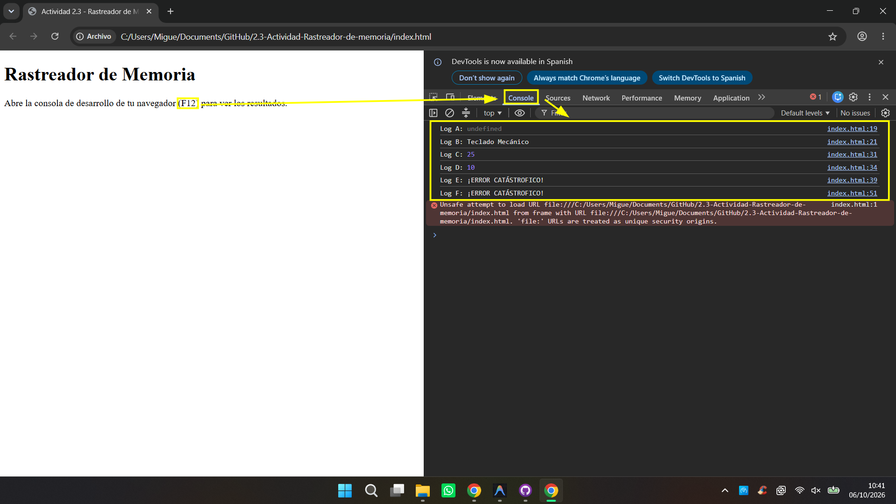

# Tarea 1: La Tabla de Predicciones

A continuación se presenta la tabla con las predicciones y sus respectivas justificaciones teóricas basadas en el código proporcionado.

| Identificador | ¿Qué imprimirá la consola? (Predicción) | Justificación Teórica |
| :--- | :--- | :--- |
| **Log A** | `undefined` | **Hoisting**: Solo se eleva la declaración con `var`, no su inicialización. Al intentar usarla su valor es `undefined`. |
| **Log B** | `Teclado Mecánico` | **Asignación**: La variable fue inicializada explícitamente en la línea anterior. |
| **Log C** | `25` | **Ámbito de bloque**: Declarada con `let` en el `if`, crea un nuevo ámbito local que prevalece sobre la exterior. |
| **Log D** | `10` | **Ámbito de función**: Fuera del `if`, el `let` ya no existe y se usa la variable `var` de la función. |
| **Log E** | `¡ERROR CATASTRÓFICO!` | **Ámbito de bloque**: Declarada con `const` en el `if`, es inaccesible desde fuera, causando error. |
| **Log F** | `¡ERROR CATASTRÓFICO!` | **Zona Muerta Temporal**: El `let` no está inicializado. Usarlo antes de declararlo lanza un error. |

## Tarea 2: Comprobación

Tras ejecutar el código abriendo el archivo `index.html` en el navegador y revisando la consola de las DevTools, contrastamos los resultados reales con la tabla de predicciones.

Como se puede observar en la siguiente captura, **los resultados reales coinciden exactamente** con las predicciones realizadas en la Tarea 1.

## Tarea 3: Conclusión Crítica

Usar `var` resulta peligroso porque las variables sufren *hoisting* y se escapan de las llaves donde las creaste.
En aplicaciones grandes, esta falta de aislamiento descontrola la lógica, fomenta la sobreescritura accidental de datos importantes y genera errores difíciles de rastrear.
